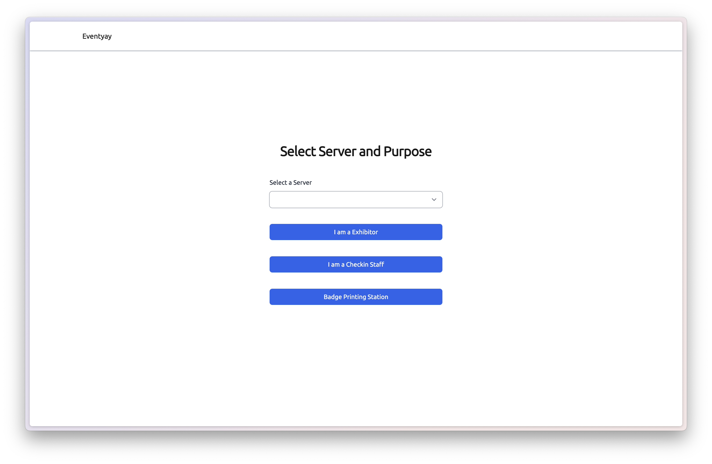
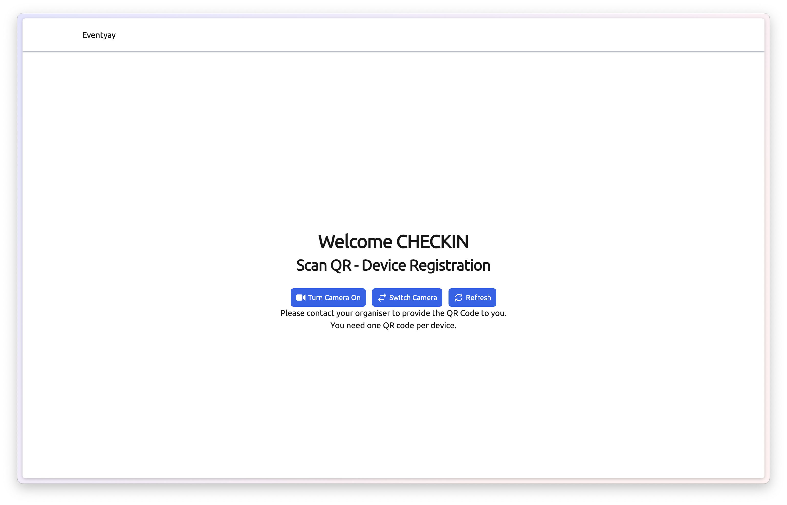
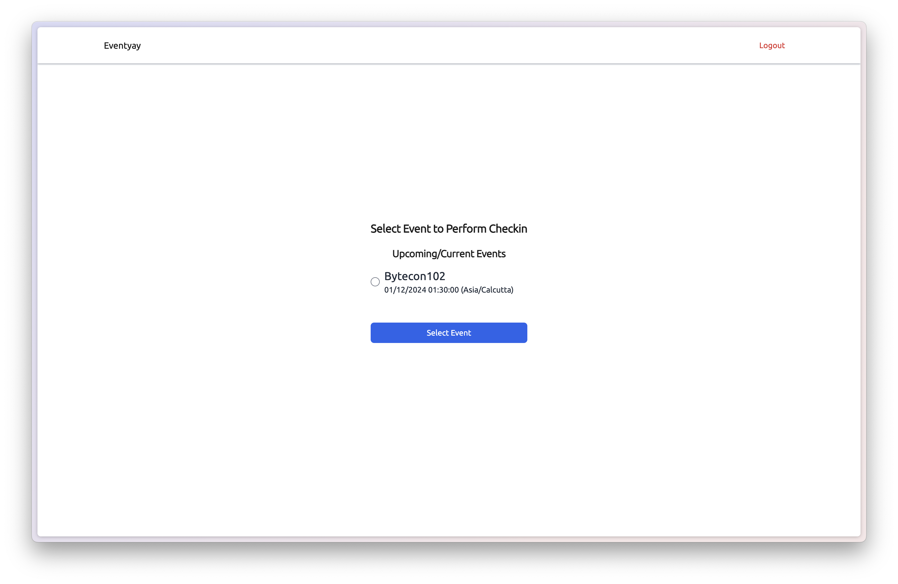
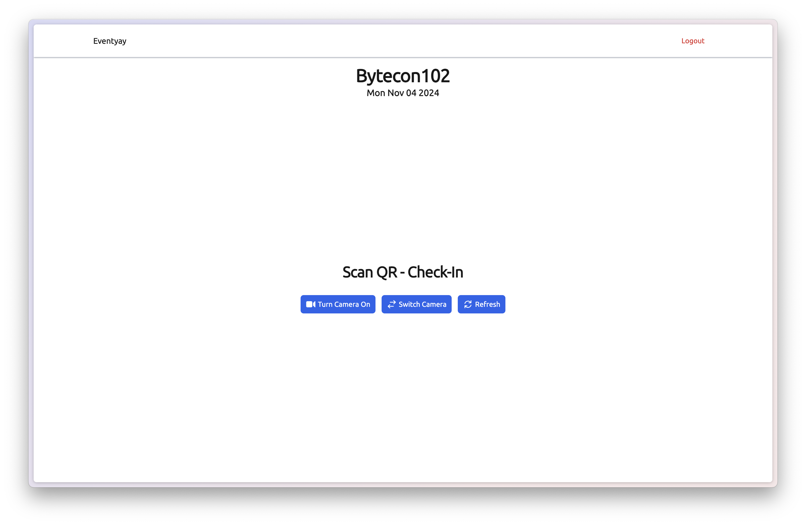
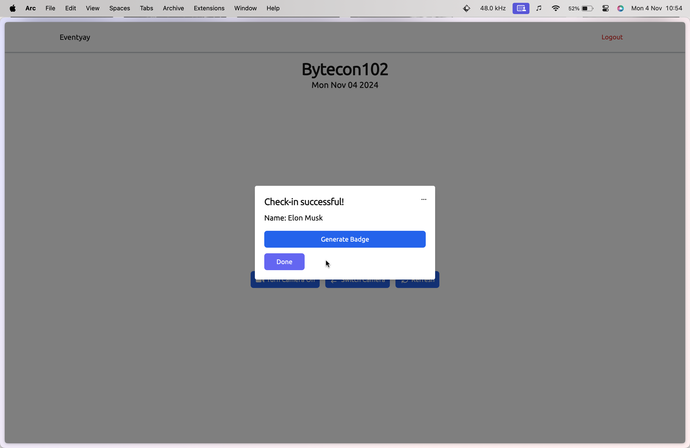
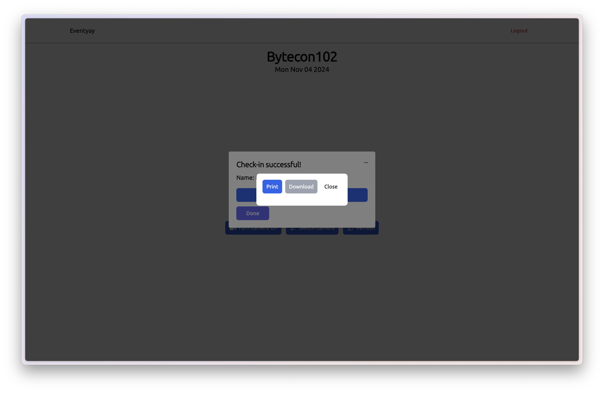
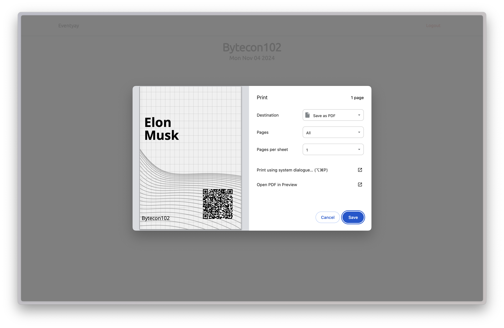

# CheckIn Workflow

**Step 1:** In the Login page Select Server and role `I am a Checkin-Staff`

**Step 2:** Turn on the camera and scan the QR to authenticate the device, the QR can be obtained from the eventyay organiser dashboard

**Step 3:** Select the event from

**Step 4:** Now turn on camera to perform checkin

**Step 5:** Once a checkin is done a popup will appear to show the details of the checked in attendee with the option to generate a badge
The Badge can be generated by clicking the `Generate Badge` button

**Step 6:** Once the badge is generated you can either choose to print or download it.

**Step 7:** If you choose to print the badge, a print dialog will appear where you can select the printer and print the badge

