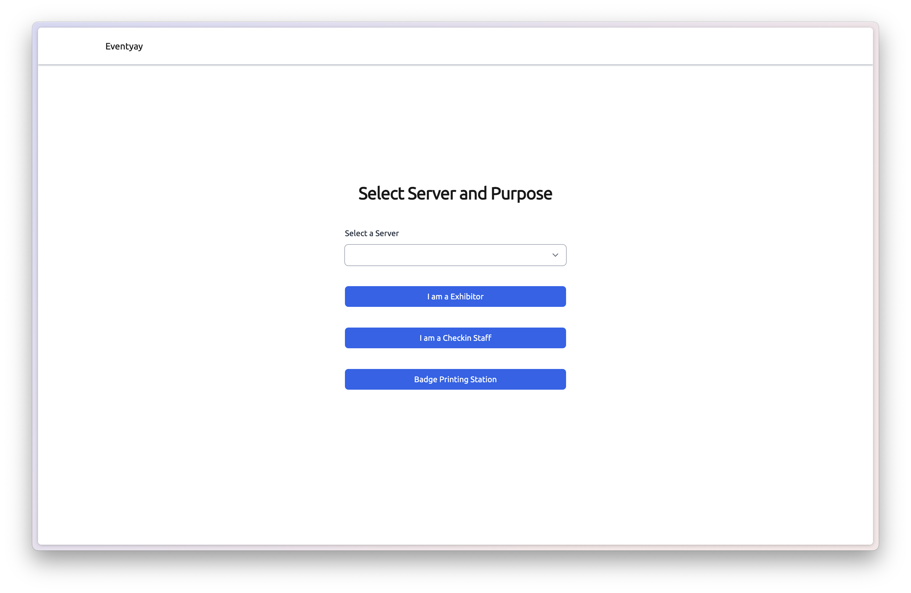
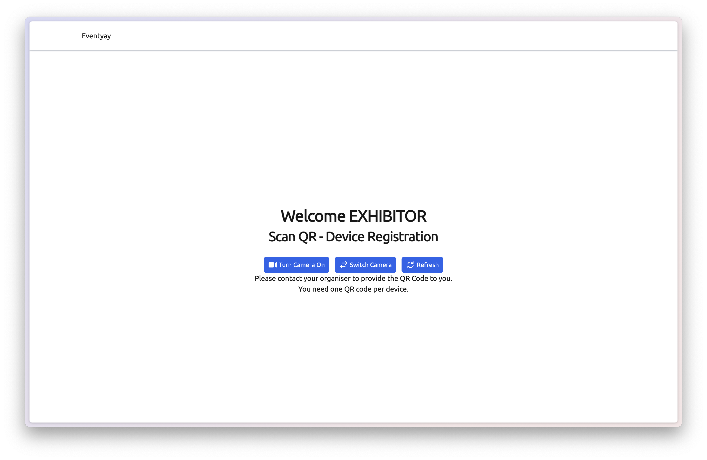
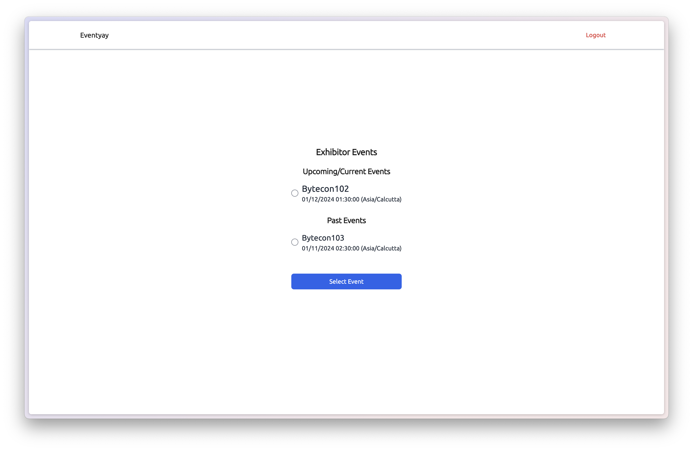
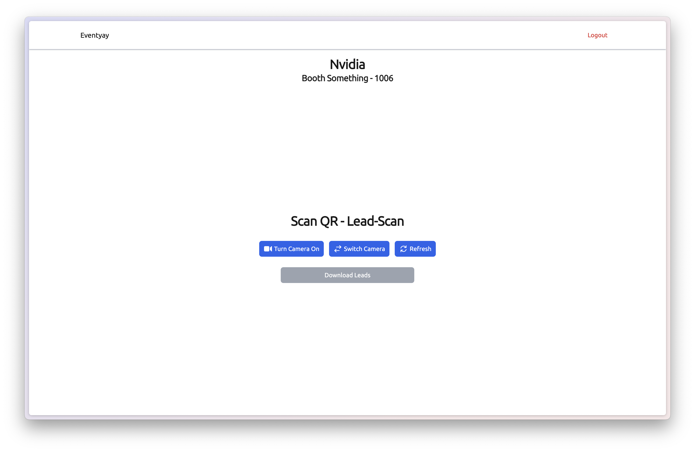
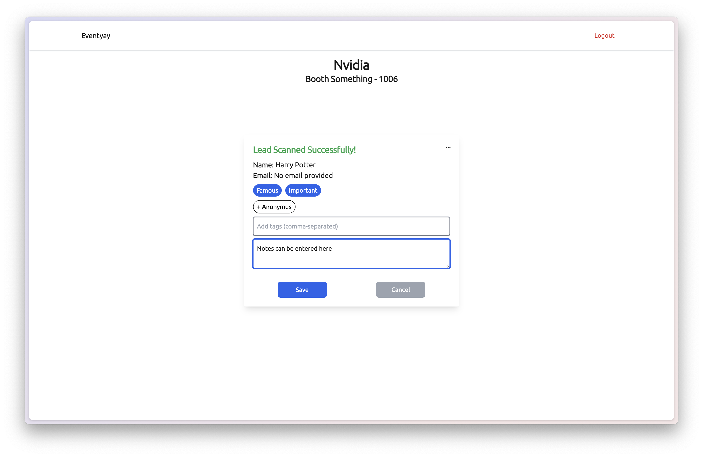

# Exhibitor Workflow

**Step 1:** In the Login page Select Server and role `I am a Exibitor`

**Step 2:** Turn on the camera and scan the QR to authenticate the device, the QR can be obtained from the eventyay organiser dashboard

**Step 3:** Select the event from the list of events that support exhibitors

> **Note:** Leads For Past events can be downloaded even after the events ends

**Step 4:** Enter the Auth Key provided by the organiser

**Step 5:** Once authenticated turn on camera to perform lead scanning

The Scanned Leads can be downloaded as a CSV file by clicking the `Download Leads` button

**Step 6:** Once a lead is scanned a popup will appear to show the details of the scanned lead to which Tags and Notes can be added

